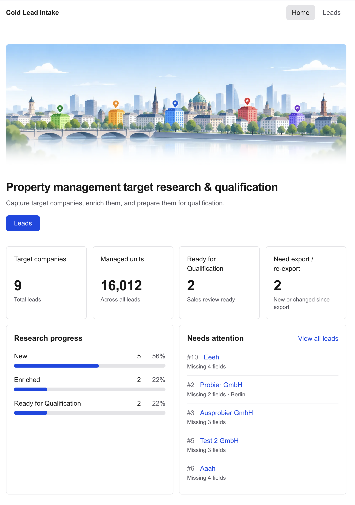
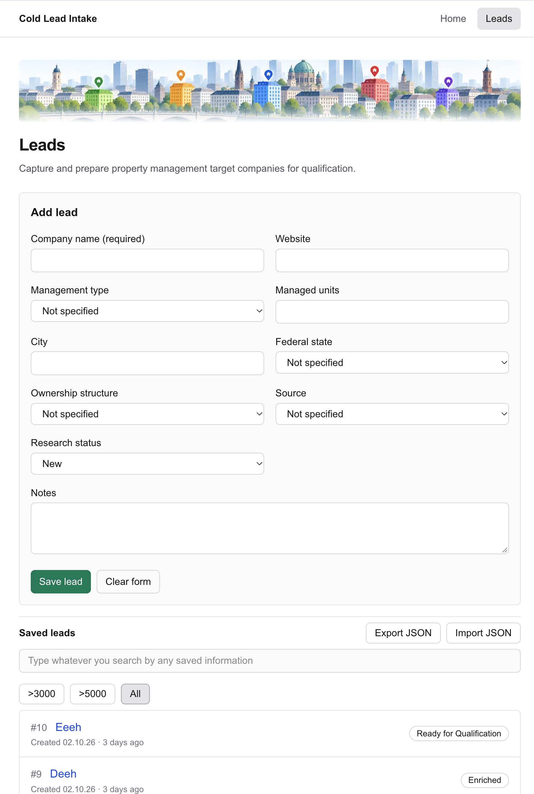

# Cold Lead Intake

A small browser-based B2B sales research app for capturing and maintaining
potential property management target companies before qualification.

## Features

- **Lead management:** create, view, edit and delete leads with company,
  website, management type (WEG / rental / both), managed units, city,
  federal state, ownership structure, source and notes.
- **Lead detail pages:** every lead has its own direct, dynamic
  `/leads/[id]` page.
- **Research status:** track each lead as New, Enriched or Ready for
  Qualification.
- **Search and filter:** free-text search across all saved information, plus
  managed-units filters.
- **Home dashboard:** key figures, research progress and a "Needs attention"
  list for incomplete, stale or modified leads.
- **JSON export and import:** back up leads or move them between browsers;
  leads changed since their last export are flagged.
- **Persistence:** leads are saved in `localStorage` and survive page reloads.
- **Responsive and friendly:** works on desktop and mobile, with clear empty
  and not-found states.

## Tech Stack

- Next.js (App Router)
- React
- TypeScript
- Tailwind CSS

## Getting Started

Requires Node.js and npm.

```bash
npm install
npm run dev
```

Then open [http://localhost:3000](http://localhost:3000).

## Data Storage

The app is local-only: there is no backend and no user accounts. Leads are
stored in your browser's `localStorage`, so they stay in one browser on one
device and are lost if site data is cleared. Use the JSON export to keep a
backup.

## Screenshots

### Home Dashboard



### Lead Management


